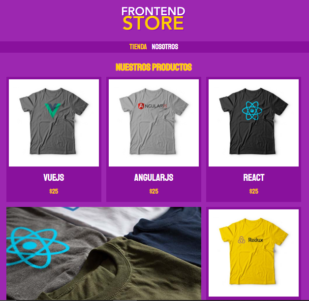
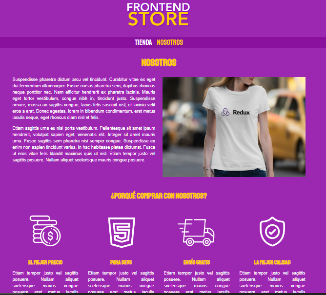
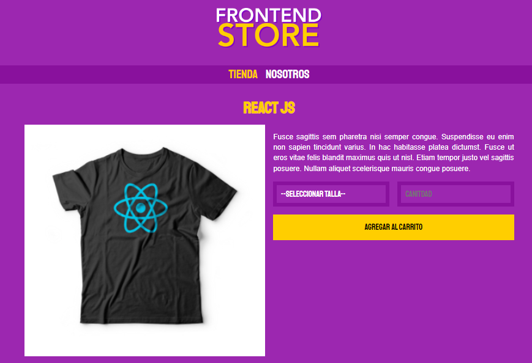

# Frontend Store

Frontend Store es un sitio web el cual esta pensado para vender camisetas con logos de tecnologias que funcionan dentro del Frontend. El objeetivo principal de este proyecto es manejar diferentes vistas asi como poner aprueba mis conocimientos en el diseño y desarrollo con 2 tecnologias, HTML y CSS. Ademas este sitio es responsive y funciona de manera correcta en cualquier dispositivo. 

## Screenshots

## Tech Stack

**Frontend:** CSS, HTML5

